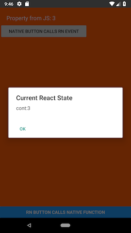
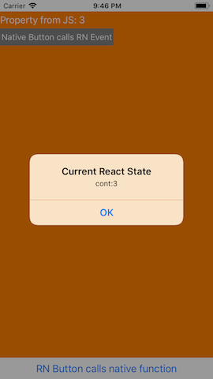

# ReactNativeBasics

Basic example of Native Modules and Native UI Components.

 


## Native UI Components

### iOS [docs](https://facebook.github.io/react-native/docs/native-components-ios)

1. Subclass `RCTViewManager` and return your native view.

	```swift
	// CustomViewManager.swift
	@objc (RCTCustomViewManager)
	class RCTCustomViewManager: RCTViewManager {
	  
	  override func view() -> UIView! {
	    return CustomView()
	  }
	  
	}
	```
	
2. Create an implementation file to define the `RCTViewManager`. 

	```objc
	// CustomViewManager.m
	@interface RCT_EXTERN_MODULE(RCTCustomViewManager, RCTViewManager)
	
	@end
	```	
	
3. Add Properties

	Declare in your View subclass

	```swift
	// CustomView.swift
	@objc var myProperty: String? {
	    didSet {
	      //do something with the value
	    }
	  }
	```
	
	also, in your implementation file
	
	```objc
	// CustomViewManager.m
	@interface RCT_EXTERN_MODULE(RCTCustomViewManager, RCTViewManager)
	RCT_EXPORT_VIEW_PROPERTY(myProperty, NSString)
	@end
	```
	
4. Add Events

	Declare it in your View subclass
	
	```swift
	// CustomView.swift
	@objc var onMyEvent: RCTBubblingEventBlock?
	```
	
	and create a convenient method to call it
	
	```swift
	// CustomView.swift
	@objc func myEvent() {
		guard let onMyEvent = onMyEvent else { return }
		
		let data = ["key":"value"] //data you want to send to JS
		onMyEvent(data)
	}
	```
	
	
	Add the event declaration in your implementation file.
	
	```objc
	// CustomViewManager.m
	@interface RCT_EXTERN_MODULE(RCTCustomViewManager, RCTViewManager)
	RCT_EXPORT_VIEW_PROPERTY(myProperty, NSString)
	RCT_EXPORT_VIEW_PROPERTY(onMyEvent, RCTBubblingEventBlock)
	@end
	```
	
### Android [docs](https://facebook.github.io/react-native/docs/native-components-android)

1. Subclass `ViewManager` and return your native view.

	```java
	// CustomViewManager.java
	public class RCTCustomViewManager extends SimpleViewManager<CustomView>
	  
		public static final String REACT_CLASS = "RCTCustomView";
		
		@Override
		public String getName() { return REACT_CLASS; }
		
		@Override
		public CustomView createViewInstance(ThemedReactContext context) {
		    LayoutInflater inflater = (LayoutInflater) context.getSystemService(Context.LAYOUT_INFLATER_SERVICE);
		    CustomView view = (CustomView)inflater.inflate(R.layout.custom_view, null);
		    return view;
		}
	  
	}
	```
	
2. Register the ViewManager

	Create a subclass of `ReactPackage`
	
	```java
	// CustomViewReactPackage.java
	public class CustomViewReactPackage implements ReactPackage {

	    @Override
	    public List<ViewManager> createViewManagers(ReactApplicationContext reactContext) {
	        return Arrays.<ViewManager>asList( new CustomViewManager() );
		}
	}
	```
	
	and register it in your `MainApplication` file
	
	```java
	@Override
	// MainApplication.java
    protected List<ReactPackage> getPackages() {
      return Arrays.<ReactPackage>asList(
          new MainReactPackage(),
              new CustomViewReactPackage()
      );
    }
	```


	
3. Add Properties

	Declare in your `CustomViewManager.java`
	
	```java
	// CustomViewManager.java
	@ReactProp(name = "myProperty")
    public void setMyProperty(CustomView view, String value) {
        //do something with the value
    }
	```
	
4. Add Events

	Create a method in your View subclass
	
	```java
	// CustomView.java
	public void performMyEvent() {
        WritableMap event = Arguments.createMap();
        event.putString("key", "value"); //data you want to send to JS
        ReactContext reactContext = (ReactContext)getContext();
        reactContext.getJSModule(RCTEventEmitter.class).receiveEvent(
                getId(),
                "myEvent",
                event);
    }
	```
	
	and in your `CustomViewManager`
	
	```java
	// CustomViewManager.java
	public Map getExportedCustomBubblingEventTypeConstants() {

        Builder events = MapBuilder.builder();

        Map onMyEvent = MapBuilder.of("phasedRegistrationNames",MapBuilder.of("bubbled", "onMyEvent"));
        events.put("myEvent", onMyEvent);

        return events.build();
    }
	```

### Javascript

1. Create a wrapper for our native component

	```js
	// CustomView.js
	
	type Props = {
	  myProperty: string,
	  onMyEvent: Function
	};
	
	class CustomView extends Component<Props> {
	
	  _onMyEvent = (event) => {
	    if (!this.props.onMyEvent) {
	      return;
	    }
	
	    this.props.onMyEvent(event.nativeEvent);
	  }
	
	  render() {
	    return <RCTCustomView
	      {...this.props}
	      onMyEvent={this._onMyEvent} />;
	  }
	}
	
	CustomView.propTypes = {
	  myProperty: PropTypes.string,
	  onMyEvent: PropTypes.func
	};
	
	var RCTCustomView = requireNativeComponent('RCTCustomView', CustomView, {
	  nativeOnly: {
	    testID: true,
	    accessibilityComponentType: true,
	    renderToHardwareTextureAndroid: true,
	    accessibilityLabel: true,
	    accessibilityLiveRegion: true,
	    importantForAccessibility: true,
	    onLayout: true,
	    nativeID: true
	  }
	});
	
	module.exports = CustomView;
	
	```

2. And to use it

	```js
	// MainView.js
	
	export default class MainView extends Component {
	
	  onMyEvent = (data: Object) => {
	    // do something with the data
	  }
	
	  render() {
	    return (
	      <View style={{ flex: 1 }}>
	        <CustomView style={{ flex: 1 }}
	          myProperty="some value"
	          onMyEvent ={this. onMyEvent}
	        />
	      </View>
	    );
	  }
	}
	```

## Native Modules

### iOS [docs](https://facebook.github.io/react-native/docs/native-modules-ios)

1. Create a class that implements `RCTBridgeModule`

	```swift
	// CustomManager.swift
	
	@objc (RCTCustomManager)
	class RCTCustomManager: NSObject, RCTBridgeModule {
	  
	  static func moduleName() -> String! {
	    return "RCTCustomManager"
	  }
	  
	  @objc func show(_ title:String, msg:String) {
	    //do something
	  }
	  
	}
	```

### Android [docs](https://facebook.github.io/react-native/docs/native-modules-android)

1. Create a class that extends `ReactContextBaseJavaModule`

	```java
	// CustomManager.java
	
	public class CustomManager extends ReactContextBaseJavaModule {
	
	    public CustomManager(ReactApplicationContext reactContext) {
	        super(reactContext);
	    }
	
	    @Override
	    public String getName() {
	        return "RCTCustomManager";
	    }
	
	    @ReactMethod
	    public void show(String title, String msg) {
	        //do something
	    }
	
	}
	
	```

2. Register the module

	Create a subclass of `ReactPackage`

	```java
	// CustomViewReactPackage.java
	
	public class CustomViewReactPackage implements ReactPackage {
	
	    @Override
	    public List<NativeModule> createNativeModules(ReactApplicationContext reactContext) {
	        List<NativeModule> modules = new ArrayList<>();
	        modules.add(new CustomManager(reactContext));
	        return modules;
	    }
	
	}
	```

	and register it in your `MainApplication` file
	
	```java
	@Override
	// MainApplication.java
    protected List<ReactPackage> getPackages() {
      return Arrays.<ReactPackage>asList(
          new MainReactPackage(),
              new CustomViewReactPackage()
      );
    }
	```

### Javascript

1. Create the Module

	```js
	// manager.js
	import { NativeModules } from 'react-native';
	
	module.exports = NativeModules.CustomManager;
	```

2. and to use it

	```js
	CustomManager.show('a title', 'a message');
	```
